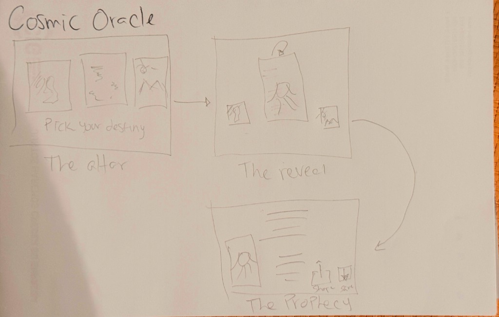

# Cosmic Oracle: From Napkin to App

This project demonstrates the power of **Google Gemini 3 Pro (Nano Banana)** to transform a rough hand-drawn sketch into a fully functional, deployed web application.

**🔴 Live Demo:** [https://cosmic-oracle-frontend-txrlrpoirq-uc.a.run.app](https://cosmic-oracle-frontend-txrlrpoirq-uc.a.run.app)

---

## From Napkin to App

### 1. The Napkin Sketch
It started with a simple idea drawn on paper. The concept was a "Cosmic Oracle" tarot reader with three main stages: Altar, Reveal, and Prophecy.

### 2. Nano Banana Pro Mockup
We fed this sketch into **Gemini 3 Pro**, which not only understood the layout but also created a complete "Neo-Arcane Cyberpunk" aesthetic, generating the code, the assets, and the logic. ([View Prompt](prompts/napkin-to-mock.md))

### 3. The Final Application
The result is a responsive, animated React application built with: ([View Prompt](prompts/app-gen.md))
*   **React 19 + Vite**
*   **Tailwind CSS v4**
*   **Framer Motion** for 3D card flips
*   **Google Cloud Run** for serverless deployment

---

## Assets Preview

The AI also generated all the tarot card assets used in the application. ([View Prompt](prompts/asset-gen.md))

| Card Back | Card Front (Sample) |
|:---:|:---:|
|  |  |

### Prophecy View

---

## Project Structure

*   `app/`: The main frontend application code.
*   `asset-gen/`: Python scripts used to generate the card assets via Gemini.
*   `assets/`: Project screenshots and design artifacts.
