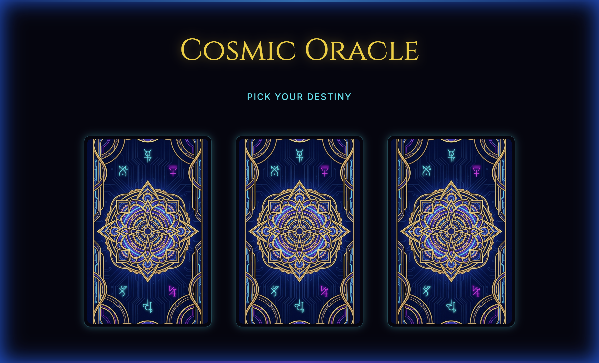

# Cosmic Oracle Cyberpunk Tarot

An immersive, interactive Tarot experience built with modern web technologies.

**🔴 Live Demo:** [https://cosmic-oracle-frontend-txrlrpoirq-uc.a.run.app](https://cosmic-oracle-frontend-txrlrpoirq-uc.a.run.app)

## Tech Stack

- **Framework**: React 19.2+ (Vite)
- **Styling**: Tailwind CSS v4
- **Animations**: Framer Motion
- **Icons**: Lucide React
- **Assets**: AI-Generated via Google Gemini 3 Pro (Nano Banana)

## Setup Guide

1. **Install Dependencies**
   ```bash
   npm install
   ```

2. **Run Development Server**
   ```bash
   npm run dev
   ```

3. **Build for Production**
   ```bash
   npm run build
   ```

## Features

- **Altar View**: Select your destiny from a shuffled deck.
- **3D Card Reveal**: Smooth CSS/Motion 3D flip animations.
- **Prophecy Generation**: Poetic, cyberpunk-themed readings.
- **Immersive UI**: Neon aesthetics, glassmorphism, and ambient effects.

## Screenshots


*The Altar View - Choose your destiny*


*The Prophecy View - Discover your fate*

## Assets

The card images were generated using a custom Python script leveraging Google's Gemini 3 Pro model, ensuring a consistent Cyberpunk Neo-Arcane aesthetic.
