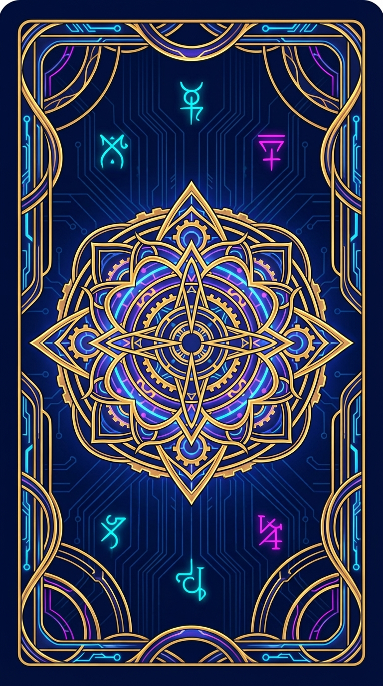
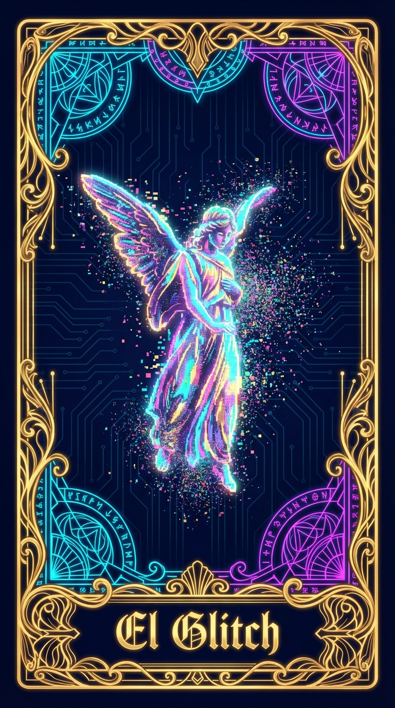
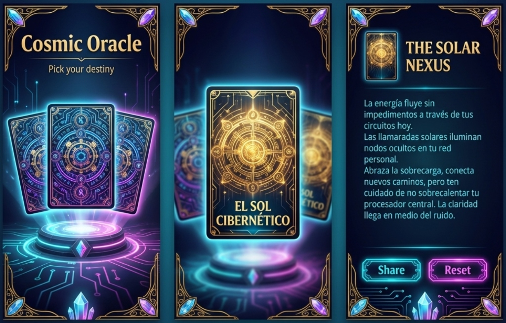

# Scripts de Generación de Assets - Cosmic Oracle

Este directorio contiene las herramientas necesarias para generar los assets gráficos del proyecto Cosmic Oracle utilizando la IA de Google (Gemini).

## Contenido

- `generate_assets.py`: Script principal de generación.
- `deck_data.json`: Definición de las cartas y sus descripciones visuales.
- `requirements.txt`: Dependencias de Python.

## Requisitos Previos

- Python 3.8+
- Acceso a internet para la API de Google GenAI.

## Instalación

Se recomienda usar un entorno virtual. Si usas `uv`:

```bash
uv venv
source .venv/bin/activate
uv pip install -r asset-gen/requirements.txt
```

O con pip estándar:

```bash
python -m venv venv
source venv/bin/activate  # En Windows: venv\Scripts\activate
pip install -r asset-gen/requirements.txt
```

## Ejecución

Desde la raíz del proyecto:

```bash
python asset-gen/generate_assets.py
```

El script verificará/creará automáticamente el archivo `.env` con la API KEY configurada si no existe.
Las imágenes generadas se guardarán en `output/cards/`.

## Preview de Assets Generados

### Cartas
| Reverso | Anverso (Ejemplo) |
|:---:|:---:|
|  |  |

### Referencia de Estilo

